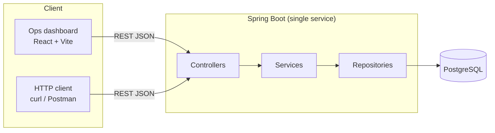
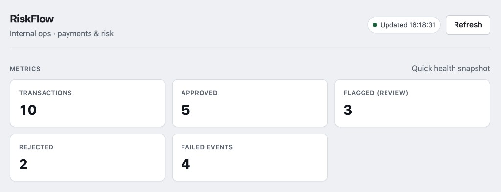
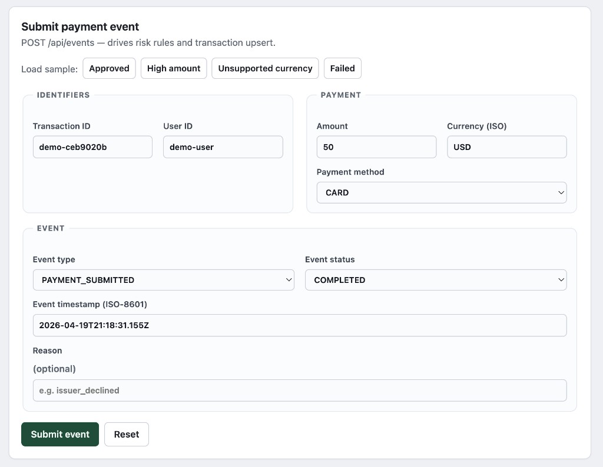
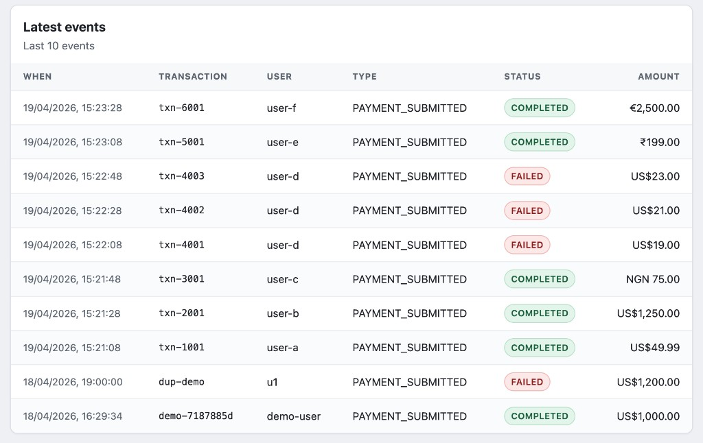
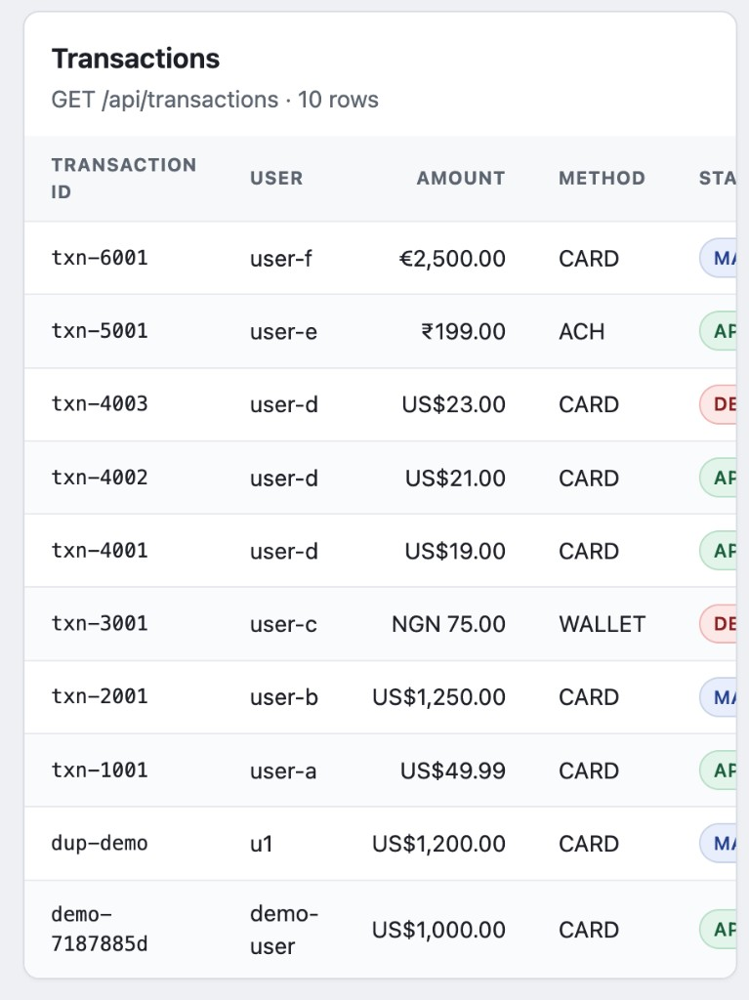
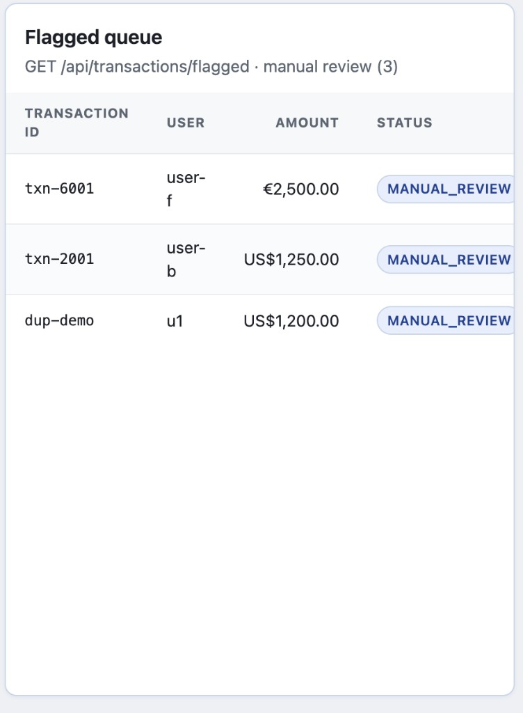

# RiskFlow

**RiskFlow** is a Spring Boot backend for ingesting payment events, applying rule-based risk checks, storing transaction state and event history in PostgreSQL, and exposing operational APIs with a lightweight demo dashboard.

---

## Why this project matters

Payment and risk systems are fundamentally about event ingestion, deterministic rules, state transitions, and operational visibility. RiskFlow compresses that into a portfolio-scale backend project that is easy to run locally, explain in interviews, and extend without rewriting the core model.

---

## Architecture

This keeps the project easy to run locally while still reflecting a production-style backend structure.



**Layers (Java):** `controller` → `service` → `repository` → `model`, plus `dto` and `exception`.

**Frontend:** `dashboard/` is a separate Vite app that proxies `/api` to the backend in dev.

---

## Domain model

| Entity | Role |
|--------|------|
| **Transaction** | Business aggregate for a payment: `transactionId`, `userId`, `amount`, `currency`, `paymentMethod`, lifecycle `status`, timestamps. |
| **PaymentEvent** | Event record of what happened: `eventType`, `status`, `reason`, `eventTimestamp`, **`rawPayload`** (serialized request), link to `Transaction`. |
| **RiskDecision** | Outcome of a risk evaluation for a transaction: `decision`, `triggeredRule(s)`, `reason`, timestamps. |

**Enums (high level):** `TransactionStatus` (e.g. `PENDING`, `APPROVED`, `DECLINED`, `MANUAL_REVIEW`), `DecisionType` (`APPROVE`, `DECLINE`, `REVIEW`), `PaymentEventType`, `PaymentEventStatus`, `PaymentMethod`.

---

## API endpoints

| Method | Path | Purpose |
|--------|------|---------|
| `GET` | `/` | Small JSON index of useful routes (avoids a blank 404 at `/`). |
| `POST` | `/api/events` | Ingest a payment event: validate → store raw event → rules → risk decision → upsert transaction. |
| `GET` | `/api/events` | List events (newest first). |
| `GET` | `/api/transactions` | List transactions (newest activity first). |
| `GET` | `/api/transactions/flagged` | Transactions in manual review (`MANUAL_REVIEW`). |
| `GET` | `/api/metrics/summary` | Counts: totals, approved, flagged, rejected, failed payment events. |

**Errors:** validation and malformed JSON return a consistent JSON shape via `GlobalExceptionHandler` (`ApiError`: `message`, `details`, HTTP status).

---

## Risk rules

### Event ingestion (`POST /api/events`)

Evaluated in `EventIngestionService` after the event is stored:

| Rule | Condition | Typical outcome |
|------|-----------|-----------------|
| **HIGH_AMOUNT** | `amount > 1000` | Manual review (`REVIEW` / `MANUAL_REVIEW`) |
| **UNSUPPORTED_CURRENCY** | currency not in **USD, EUR, INR** | Decline |
| **REPEATED_FAILURES** | same `userId` has **≥ 3** failed payment events in the **last 24h** (only evaluated on `PAYMENT_SUBMITTED`) | Decline |

**Idempotency (demo-safe):** duplicate submissions with the same **`transactionId` + `eventType` + `eventTimestamp`** return a stable response and do not create duplicate rows.

---

## Frontend dashboard

A lightweight React + Vite dashboard is included for demos. It supports:
- metrics summary
- payment event submission
- recent events
- transaction search/filtering
- flagged transaction queue

The UI is intentionally thin so the backend remains the focus.

### Metrics snapshot

Aggregates from `GET /api/metrics/summary` — totals, approvals, manual review queue, rejections, and failed payment events.



### Submit payment event

`POST /api/events` with one-click sample payloads for demo flows (approved, high amount, unsupported currency, failed).



### Latest events

Recent ingested events (`GET /api/events`) — good for showing append-style logging and mixed outcomes.



### Transactions + filters

`GET /api/transactions` with client-side search (transaction / user) and status filter.



### Flagged queue

`GET /api/transactions/flagged` — items in `MANUAL_REVIEW` for human follow-up.



---

## How to run locally

### Prerequisites

- **Java 17**
- **PostgreSQL** reachable locally
- **Node.js 20+** (for the dashboard)

### 1) Database

Create DB + role (example names match `application.properties` defaults):

```sql
CREATE ROLE riskflow LOGIN PASSWORD 'riskflow';
CREATE DATABASE riskflow OWNER riskflow;
```

Adjust `spring.datasource.*` in `src/main/resources/application.properties` if you use different credentials.

### 2) Backend

From the repo root:

```bash
./mvnw spring-boot:run
```

Optional **demo dataset** on startup (append-only; uses the same ingestion rules; does not wipe data):

```bash
./mvnw spring-boot:run -Dspring-boot.run.arguments="--riskflow.demo.seed=true"
```

Flags (see `application.properties`):

- `riskflow.demo.seed=true` — run demo seed runner on startup  
- `riskflow.demo.force=true` — bypass the “note when data exists” path (still non-destructive)

### 3) Dashboard

```bash
cd dashboard
npm install
npm run dev
```

Open the printed URL (usually `http://localhost:5173`).

---

## Sample payload (`POST /api/events`)

```json
{
  "transactionId": "txn-demo-001",
  "userId": "user-demo-42",
  "amount": 1250.0,
  "currency": "USD",
  "paymentMethod": "CARD",
  "eventType": "PAYMENT_SUBMITTED",
  "status": "COMPLETED",
  "eventTimestamp": "2026-04-19T12:34:56Z",
  "reason": "checkout_completed"
}
```

**Notes:**

- `currency` must be a **3-letter uppercase** ISO code in this MVP.
- `eventTimestamp` should be ISO-8601 (instant).

---

## Demo script (recruiter walkthrough)

See **`docs/DEMO_SCRIPT.md`** for a short spoken walkthrough, UI flow, and copy-paste sample payloads.

Screenshot source files live in **`docs/screenshots/`** (see `docs/screenshots/README.md` to replace or refresh images).

---

## Future improvements (intentionally out of scope for now)

- **DB uniqueness** for idempotency keys (concurrent duplicate POSTs).
- **Async risk** (queue) if event volume grows; keep the domain model stable.
- **Audit/versioning** for risk rule changes (who changed what).
- **Authn/z** and multi-tenant isolation for anything beyond local demos.
- **OpenAPI** spec if you want machine-readable contracts (skipped by design here).

---

## Author

**Shree Meher**

- [GitHub](https://github.com/s-meher)
- [LinkedIn](https://www.linkedin.com/in/shree-meher/)
- [Portfolio](https://shree-portfolio-virid.vercel.app/)

